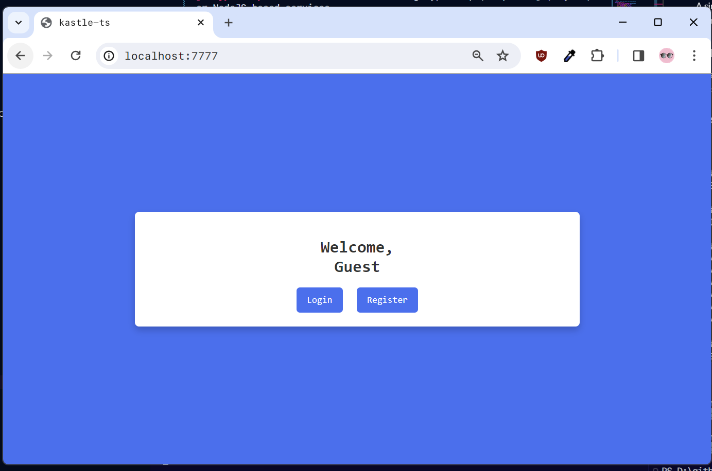

# kastle-ts


A simple user registration and login service with **express.js@TypeScript**. Good start for learning TypeScript, express.js, JWT Token(`jsonwebtoken`), MySQL, or NodeJS based services.

### Features
Because it's main purpose is learn NodeJS-based web frameworks, there are no special features, just user registration, login, and logout. The user logged session will be managed by JWT(JSON Web Token), and user password will be stored after encryption with BCrypt. Also provide basic necessary validity checks like blocking logging in after login, checking account existence before registering a new user with a specific ID.



### Prerequisites
1. Go to `.env` file and adjust the environmental variables (especially for MySQL databases.)
```env
# Express.js server
SERVER_ACCESS_PORT=7777

# Token secret
JWT_SECRET="kastle_ts"

# MySQL database
MYSQL_DB_HOST="localhost"
MYSQL_DB_PORT=3306
MYSQL_DB_USER="root"
MYSQL_DB_PASSWORD="pass12##"
MYSQL_USER_DATABASE_NAME="kastle_ts"
MYSQL_USER_TABLE_NAME="users"

# Bcrypt salt
BCRYPT_SALT_COUNT=10
```

2. Create a table to store user information in MySQL database, `(${env.MYSQL_USER_DATABASE_NAME}.${env.MYSQL_USER_TABLE_NAME})`
```sql
-- A user table to store user information
CREATE TABLE users (
    UserID INT AUTO_INCREMENT PRIMARY KEY,
    Username VARCHAR(50) NOT NULL,
    Email VARCHAR(100) NOT NULL,
    Password VARCHAR(255) NOT NULL
);
```

3. Install NPM dependencies. Detailed requirements are described in `/package-lock.json` and `/package.json`.
```powershell
npm install
```